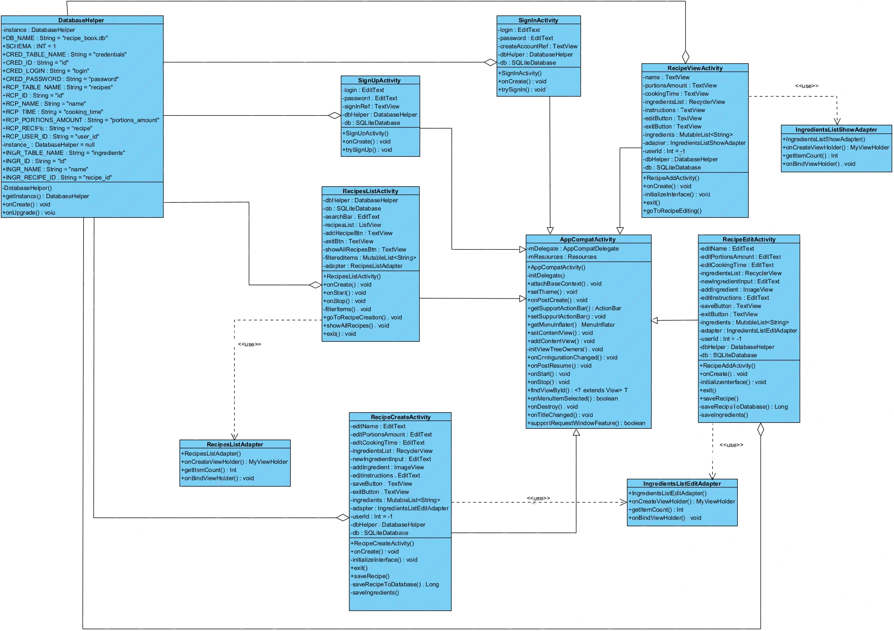

# Диаграмма классов  

 

# Глоссарий

| Класс | Описание |
|:---|:---|
| AppCompatActivity | Базовый класс активностей, использующих современные функции Android |
| SignUpActivity | Класс окна регистрации |
| SignInActivity | Класс окна входа в аккаунт |
| RecipeViewActivity | Класс окна просмотра рецепта |
| RecipesListActivity | Класс окна просмотра списка рецептов |
| RecipeEditActivity | Класс окна редактирования рецепта |
| RecipeCreateActivity | Класс окна создания рецепта |
| IngredientsListShowAdapter | Класс адаптера списка просмотра ингредиентов |
| IngredientsListEditAdapter | Класс адаптера списка редактирования ингредиентов |
| RecipesListAdapter | Класс адаптера списка просмотра списка рецептов |
| DatabaseHelper | Класс для взаимодействия с базой данных |

