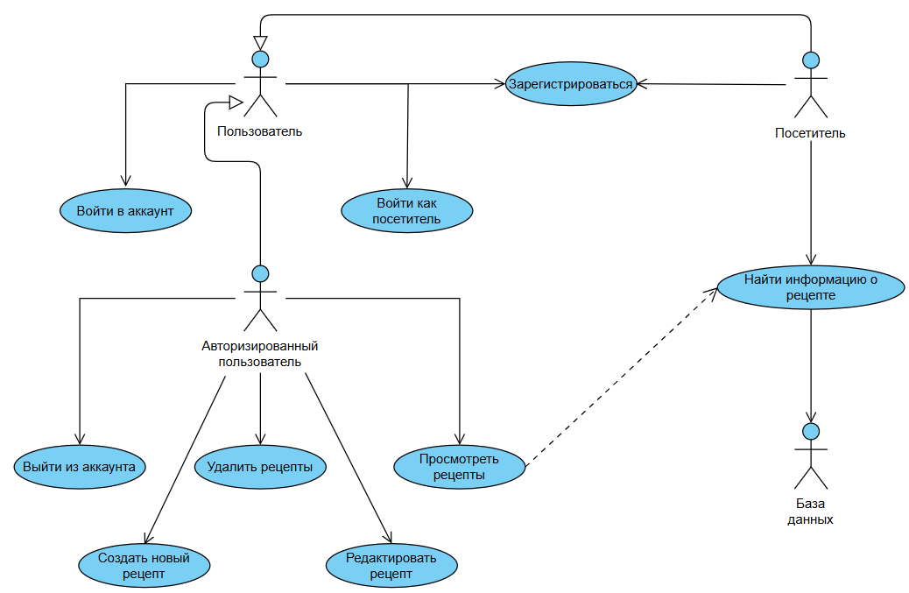

# Диаграмма вариантов использования

 
  
# Глоссарий

| Термин | Определение |
|:--|:--|
| Пользователь | Человек, использующий приложение |
| Авторизованный пользователь | Пользователь, прошедший авторизацию в приложении |
  
# Поток событий 

# Содержание
1 [Актёры](#1)  
2 [Варианты использования](#2)  
2.1 [Войти в аккаунт](#21)  
2.2 [Зарегистрироваться](#22)    
2.3 [Просмотреть рецепты](#23)  
2.4 [Выйти из аккаунта](#24)  
2.5 [Создать новый рецепт](#25)  
2.6 [Редактировать рецепт](#26)  
2.7 [Удалить рецепт](#27)     

<a name="1"/>

# 1 Актёры

| Актёр | Описание |
|:--|:--|
| Пользователь | Человек, использующий приложение |
| Авторизованный пользователь | Пользователь, прошедший авторизацию в приложении |

<a name="2"/>

# 2 Варианты использования

<a name="21"/>

## 2.1 Войти в аккаунт

**Описание.** Вариант использования "Войти в аккаунт" позволяет пользователю войти в учётную запись.  
**Предусловия.** Пользователь вошел на страницу входа в аккаунт.  
**Основной поток.**
1. Приложение отображает окно входа в аккаунт.
2. Пользователь вводит данные.
3. Пользователь подтверждает ввод.
4. Приложение запоминает ID (в БД) пользователя.
5. Приложение скрывает окно входа в аккаунт.
6. Приложение открывает окно просмотра рецептов данного подьзователя и загружает туда рецепты этого пользователя.
7. Вариант использования завершается.

<a name="22"/>

## 2.2 Зарегистрироваться

**Описание.** Вариант использования "Зарегистрироваться" позволяет пользователю создать свой аккаунт в приложении.  
**Предусловия.** Пользователь захотел зарегистрироваться в приложении и перешёл на страницу регистрации.  
**Основной поток.**
1. Приложение отображает окно регистрации, в котором запрашивает у пользователя ввод данных.
2. Пользователь вводит данные (логин и пароль).
3. Пользователь подтверждает ввод (нажимает кнопку регистрации).
4. Приложение проверяет введённое имя на совпадение с именами уже зарегистрированных пользователей. Если совпадение выявлено, выполняется альтернативный поток А1.
5. Приложение создает аккаунт пользователя в базе данных.
6. Приложение скрывает окно регистрации.
7. Вариант использования завершается.

**Альтернативный поток А1.**
1. Приложение сообщает пользователю, что пользователь с таким именем уже существует.
2. Приложение запрашивает у пользователя ввод другого имени.
3. Возврат к п.2 основного потока.

<a name="23"/>

## 2.3 Просмотреть рецепты

**Описание.** Вариант использования "Просмотреть рецепты" позволяет авторизованному пользователю просмотреть свои рецепты.   
**Предусловия.** Пользователь вошел в свйо аккаунт.  
**Основной поток.**
1. Приложение отображает окно просмотра рецептов;
2. Пользователь вводит название рецепта или хотя бы его часть.
3. Приложение выполняет запрос к БД на поиск рецепта с таким же или похожим названием.
4. Приожение выводит список найденных в БД рецептов.
5. Вариант использования завершается.

<a name="24"/>

## 2.4 Выйти из аккаунта

**Описание.** Вариант использования "Выйти из аккаунта" позволяет авторизованному пользователю выйти из аккаунта.  
**Предусловия.** Авторизованный пользователь нажал на кнопку "Выйти".  
**Основной поток.**
1. Приложение производит выход из аккаунта и открывает страницу входа в аккаунт.
2. Вариант использования завершается.

<a name="25"/>

## 2.5 Создать новый рецепт

**Описание.** Вариант использования "Создать новый рецепт" позволяет авторизованному пользователю создавать новые рецепты.  
**Предусловия.** Пользователь нажал на кнопку "Создать рецепт".  
**Основной поток.**
1. Приложение выводит окно создания рецепта.
2. Пользователь вводит необходимые данные.
3. Пользователь нажимет кнопку "Сохранить рецепт".
4. Приложение сохраняет рецепт.
5. Приложение закрывает окно создания рецепта.
6. Вариант использования завершается.

<a name="26"/>

## 2.6 Редактировать рецепт

**Описание.** Вариант использования "Редактировать рецепт" позволяет авторизованному пользователю редактировать созданные рецепты.  
**Предусловия.** Пользователь нажал кнопку "Редактировать" для своего рецепта.  
**Основной поток.**
1. Приложение выводит окно редактирования рецептов.
2. Пользователь изменяет необходимые данные.
3. Пользователь нажимает кнопку "Сохранить рецепт".
4. Приложение обновляет данные о рецепте.
5. Приложение закрывает окно редактирования рецепта.
6. Вариант использования завершается.

<a name="27"/>

## 2.7 Удалить рецепт

**Описание.** Вариант использования "Удалить рецепт" позволяет авторизованному пользователю удалить свой рецепт.  
**Предусловия.** Пользователь нажал кнопку "Удалить" для своего рецепта.  
**Основной поток.**
1. Приложение удаляет рецепт из списка.
2. Вариант использования завершается.
